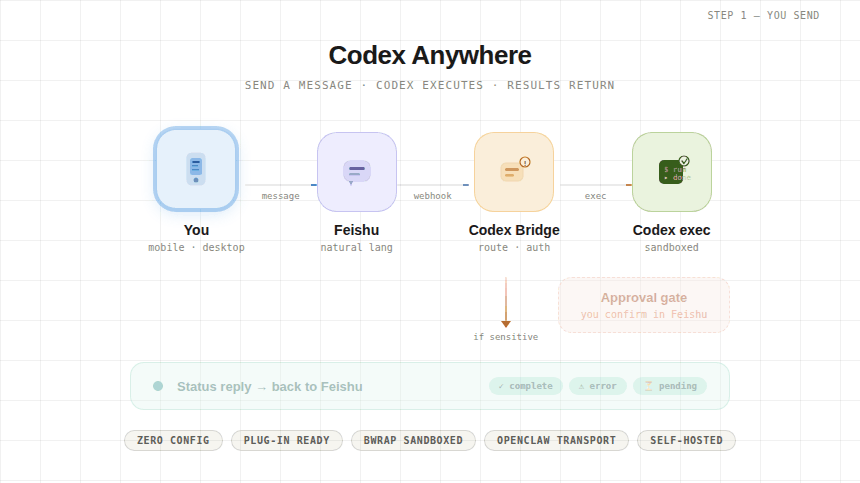

# Codex Anywhere

> 用最低心智，从 Feishu 远程驱动你自己的 Codex，并让状态、结果和最终产物自然回到当前会话。

<p align="center">
  
</p>

<p align="center">
  <a href="docs/deployment-p1-cross-platform.md">部署文档</a> ·
  <a href="SECURITY_MODEL.md">安全模型</a> ·
  <a href="docs/feishu-codex-bridge-v1.md">Bridge 协议</a>
</p>

## 是什么

`Codex Anywhere` 不是第二个助手，而是把你自己的 `Codex` 远程延伸到 `Feishu`：

1. 你在 Feishu 私聊里直接给 `Codex` 发自然语言。
2. bridge 只在显式 `/codex ...`、审批闭环、最小控制面这些必要边界上接一下。
3. 运行状态、最终摘要，以及 `Codex` 显式声明的最终可消费产物，会默认原路回到当前 Feishu 会话。

这让你可以在手机、平板、另一台电脑上，持续操控自己的主机环境，而不用重新学习一套桥接产品。

## 核心能力

- 低心智主路径：普通消息默认直达 `Codex`，只在必要边界上显式出现 bridge
- 同会话闭环：状态、结果和最终产物默认回到发起它的当前 Feishu 会话
- Native-first 命令面：显式启动 / 续写优先贴近原生 `Codex` 参数名
- 审批可控：高风险动作走显式确认，按钮优先，文案尽量最短
- 跨平台部署：Linux 与 Windows 都有可落地安装路径
- 隔离执行：结合 OpenClaw + runtime 策略约束执行边界

## 最低基础设施

- Linux 主机的 `/usr/bin/bwrap >= 0.9.0`
- `codex-cli 0.120.0` 是当前验证基线；当前版本会直接调用系统 `/usr/bin/bwrap`
- `bootstrap` / `preflight` 会额外执行一次 `codex sandbox linux -- /bin/true` 实探
- 如果执行环境不满足最低要求，bridge 会在任务启动前直接拒绝，而不是进入假运行态

## 快速开始

Linux:

```bash
export CODEX_FEISHU_APP_ID='cli_xxx'
export CODEX_FEISHU_APP_SECRET='xxx'
./scripts/install.sh
```

Windows (PowerShell):

```powershell
$env:CODEX_FEISHU_APP_ID = "cli_xxx"
$env:CODEX_FEISHU_APP_SECRET = "xxx"
.\scripts\install.ps1
```

安装健康状态文件：

`./.isolated/codex-feishu/state/install-health.json`

## 安装后 60 秒自检

1. 在 Feishu 私聊机器人发送：`/codex doctor`
2. 再直接发送一条普通自然语言（例如：`你好，小码`）
3. 最后发送一条显式命令
   - Linux：`/codex --cd /path/to/Codex-Anywhere 帮我看 README`
   - Windows：`/codex --cd C:\path\to\Codex-Anywhere 帮我看 README`

如果三步都得到预期响应，说明消息链路和执行链路都已通。

## 当前执行语义

- 自然语言是主路径；只有显式启动或续写持续会话时才使用 `/codex ...`
- bridge 只在显式 `/codex ...` 启动面，或自有审批 / 控制面闭环里做最薄 gate；普通文本语义默认仍归 `Codex`
- reply plane 当前已落地 Phase 1：最终摘要和 `Codex` 显式声明的最终可消费产物，会默认按当前任务 origin 原路回到 Feishu
- 当前不会自动扫描目录猜测要回传什么；只有 `Codex` 声明的最终产物才会被回传
- paired bridge 私聊的 Full Access 按 DM 级状态记住：显式高权限获批后，后续任务默认沿用，直到显式降权或 reset
- 显式申请 Full Access：`/codex --cd <path> --sandbox danger-full-access <prompt>`
- 显式降回普通默认权限：下一次显式 `/codex` 启动或续写时带 `--sandbox workspace-write`
- `--ask-for-approval never` 只影响审批策略，不等于 Full Access，也不替代 `--sandbox` 的选择
- 当前 reply plane 只支持 same-origin 默认闭环；显式跨 origin 改投仍不属于当前主路径

## 常用命令

- 普通任务：直接发送自然语言
- 新任务：`/codex --cd <path> <prompt>`
- 继续当前任务：`/codex resume <prompt>`
- 健康检查：`/codex doctor`
- 显式全权限（按需使用）：`/codex --cd <path> --sandbox danger-full-access <prompt>`
- 显式降权：`/codex --cd <path> --sandbox workspace-write <prompt>`

## 服务运维

Linux `systemd --user` 安装默认使用：

- 状态：`systemctl --user status openclaw-codex-feishu.service`
- 重启：`systemctl --user restart openclaw-codex-feishu.service`
- 日志：`journalctl --user -u openclaw-codex-feishu.service -n 200 --no-pager`

## 排障最短路径

1. 先看 Feishu 侧：`/codex doctor`
2. 再看安装状态：`./.isolated/codex-feishu/state/install-health.json`
3. 再看宿主日志
   - Linux：`journalctl --user -u openclaw-codex-feishu.service -n 200 --no-pager`
   - Windows：`%LOCALAPPDATA%\Temp\openclaw\openclaw-YYYY-MM-DD.log`

Windows 常见噪声（非阻断）：

- `plugins.allow is empty`
- `no im.chat.access_event.bot_p2p_chat_entered_v1 handle`
- 启动阶段短暂 `unresolved SecretRef ... CODEX_FEISHU_APP_SECRET`（若后续 `ws client ready` 正常出现，通常可忽略）

## 文档索引

- 跨平台部署：`docs/deployment-p1-cross-platform.md`
- 安全与隔离：`SECURITY_MODEL.md`
- Feishu Bridge 协议：`docs/feishu-codex-bridge-v1.md`
- 体验回归清单：`docs/experience-regression-checklist.md`
- Reply plane 设计：`docs/superpowers/specs/2026-04-04-reply-plane-origin-manifest-design.md`

## 设计源文件

README 头图的可编辑版本在：

- `imgs/codex_anywhere.html`（HTML 动图模板）
- `imgs/codex_anywhere.gif`（README 当前展示动图）
